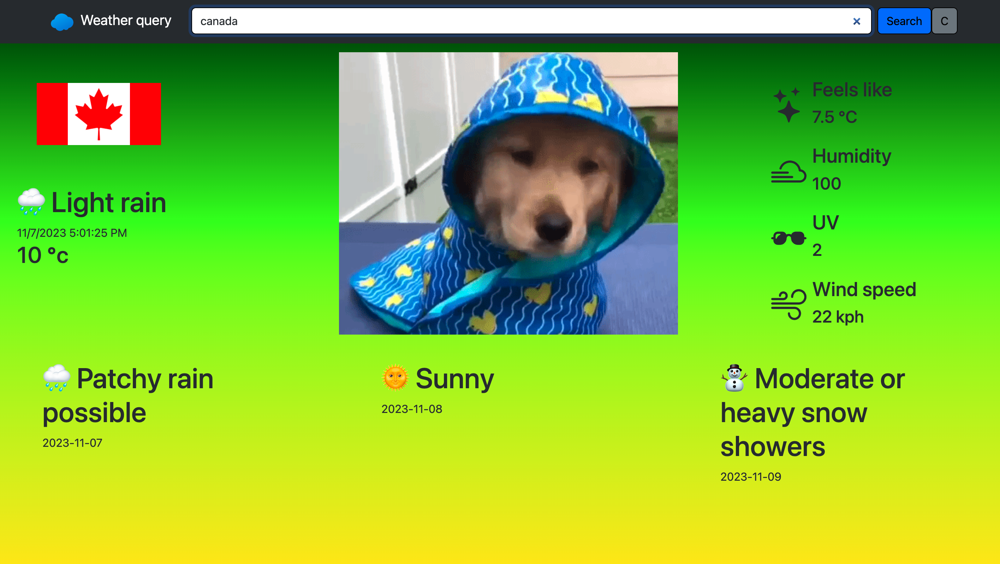
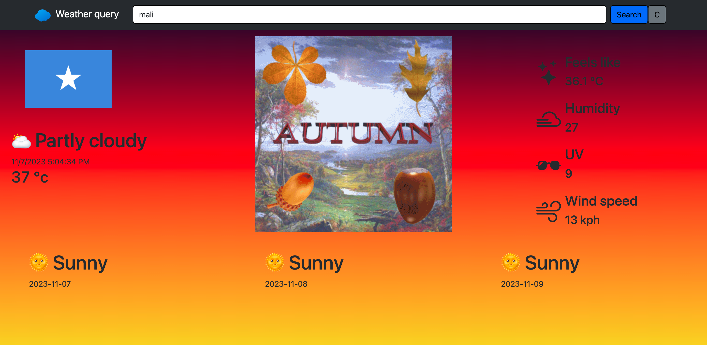

# Weather-query

demo: [https://react-cvbuilder.netlify.app/](https://react-cvbuilder.netlify.app/)

Hey there this is me AZKA 🙋‍♂️

and this is React Weather query which You can use it to check weather forecast and current weather conditions, it's also reactive to weather result depending on current weather background color changes:).

✏️ How to use it:

- Just search for a country/city
- If background gradient is red/yellow it's hot, if blue/cyan it's cold and if it's green/yellow it's Temperate

🔴 Things i learned:
1- React basics
2- Error handling with useEffect

🤔 further improvements:

- Media queries for mobile devices
- A nicer format for weather forecast
- Better component structure
